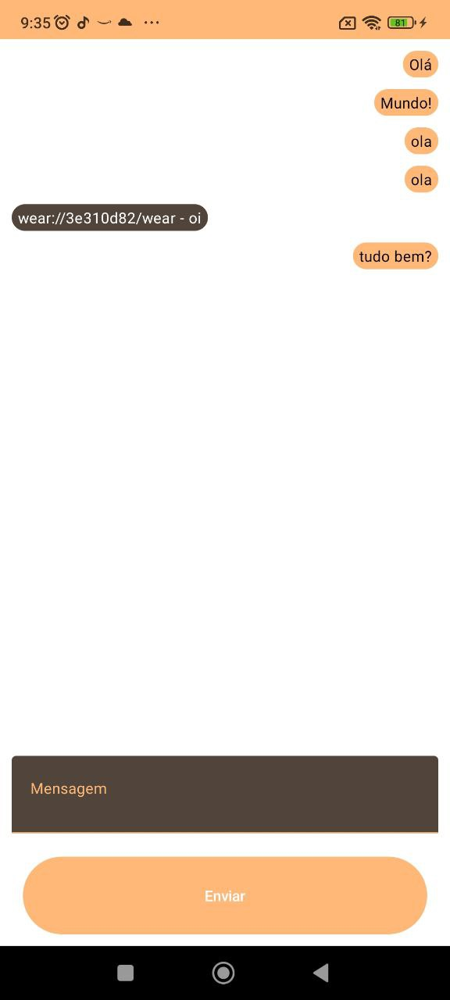
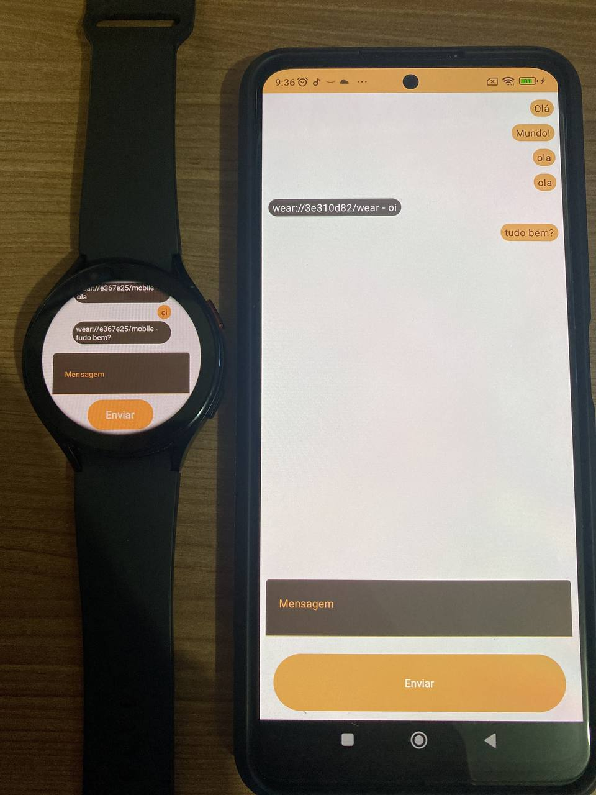
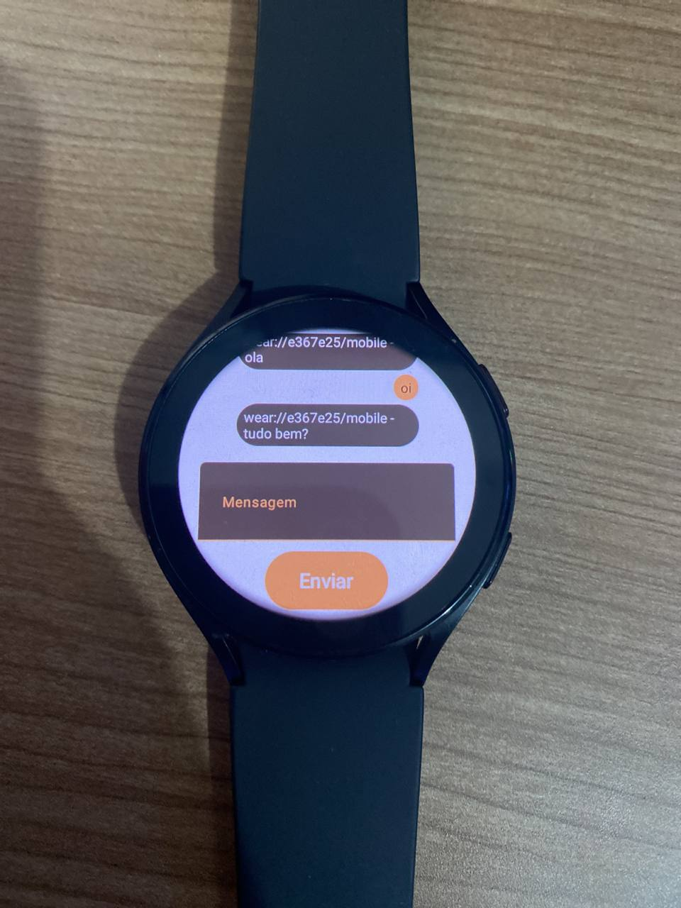
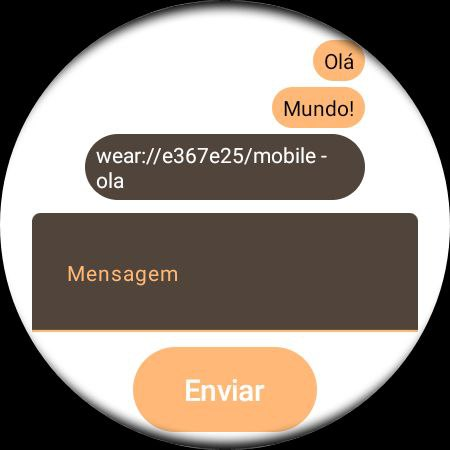
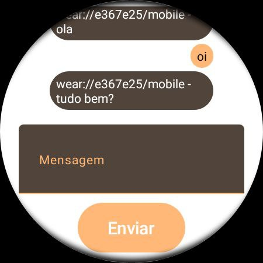

# [EN-US] - Message communication using Wearable Data Layer - Android/Wear OS : PT[BR] - Comunicação de mensagem usando camada de dados wearable - Android/Wear OS

Um aplicativo de comunicação de mensagem bidirecional para Wear OS que faz uso da API Wearable Data Layer. Envie/receba mensagens de seu dispositivo vestível/móvel.

## Introdução

Esta amostra demonstra como fazer com que um dispositivo portátil e um dispositivo Wear se comuniquem usando o [DataClient][2]. Ambos os app podem enviar mensgens entre os dispositivos conectados.

Uma atividade está sendo usada para ambos os dispositivos conectados que implementam suas partes de as interfaces necessárias usando o Jetpack Compose.

Ele mostra como usar um [WearableListenerService][1] para consumir DataEvents
bem como implementações para vários ouvintes necessários ao usar o [DataClient][2],
[MessageClient][3] e [NodeClient][4].

[1]: https://developers.google.com/android/reference/com/google/android/gms/wearable/WearableListenerService
[2]: https://developers.google.com/android/reference/com/google/android/gms/wearable/DataClient
[3]: https://developers.google.com/android/reference/com/google/android/gms/wearable/MessageClient
[4]: https://developers.google.com/android/reference/com/google/android/gms/wearable/NodeClient

## Pré-requisitos

- Android SDK 32

## Screenshots

## Começando

Esta amostra usa o sistema de compilação Gradle. Para construir este projeto, use o
comando "gradlew build" ou use "Import Project" no Android Studio.

## Apoiar

- Stack Overflow: https://stackoverflow.com/questions/tagged/wear-os

Se você encontrou um erro neste exemplo, registre um problema no rastreador de problemas.

Patches são encorajados e podem ser enviados por bifurcação deste projeto e
enviando uma solicitação pull por meio do GitHub. Consulte CONTRIBUTING.md para obter mais detalhes.
